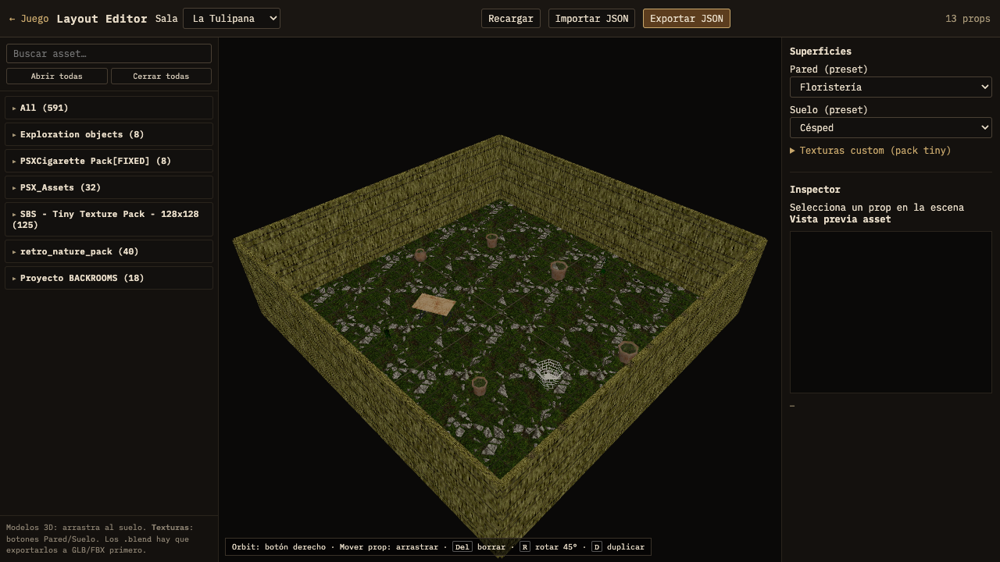

# BACKROOMS — Layout Editor

Editor visual en navegador para colocar **props 3D**, texturas de pared/suelo y exportar layouts JSON usados por el juego [BACKROOMS Portfolio](https://github.com/IsmaelRivela/backrooms-portfolio).



## Qué hace

- Previsualiza cada **sala de proyecto** (Tulipana, Copydad, VAMPS Brand, etc.)
- **Catálogo** de assets 3D filtrable (GLB/FBX del pack)
- **Drag & drop** de modelos al suelo de la sala
- Inspector: posición, rotación, escala, `fitSize`, spin, `objectName` (FBX multi-mesh)
- **Temas** de superficie: presets + texturas custom del pack tiny
- **Exportar / importar** JSON compatible con `public/room-layouts/<projectId>.json`

## Requisitos

- Node.js 20+
- npm
- Mismos assets que el juego (`public/assets/…`)

## Instalación

```bash
npm install
npm run dev
```

Abre **http://localhost:5173/layout-editor.html**

> El editor comparte código con el juego (`src/world/`, catálogo, loaders). Este repo incluye el proyecto completo; solo cambia el punto de entrada HTML.

## Uso rápido

1. Elige **Sala** en el desplegable superior.
2. Busca un asset en el catálogo izquierdo y **arrástralo** al viewport.
3. Selecciona un prop → edita valores en el **Inspector** derecho.
4. **Exportar JSON** → copia el resultado a `public/room-layouts/<id>.json` del juego.
5. **Recargar** en el juego (`R` o F5) para ver los cambios.

### Atajos en viewport

| Acción | Control |
|--------|---------|
| Orbitar cámara | Botón derecho |
| Mover prop | Arrastrar |
| Rotar 45° | **R** |
| Duplicar | **D** |
| Borrar | **Supr** |

## Formato JSON (`room-layouts`)

```json
{
  "version": 1,
  "projectId": "vamps-brand",
  "theme": {
    "wallTexture": "/assets/textures/tiny/Bricks/Bricks_11-128x128.png",
    "floorTexture": "/assets/textures/tiny/Tile/Tile_11-128x128.png"
  },
  "props": [
    {
      "id": "mi-prop",
      "label": "TV",
      "src": "/assets/itch/psx-assets/models/tv.glb",
      "kind": "model",
      "position": [0, 0, -2],
      "scale": 1,
      "space": "room",
      "rotationDeg": [0, 270, 0],
      "fitSize": 1
    }
  ]
}
```

- **`position`**: offset X/Y/Z desde el **centro** de la sala (`space: "room"`).
- **`pickup`**: opcional, p. ej. `"cigarette"` para objetos recogibles en el juego.
- **`objectName`**: sub-mesh dentro de un FBX (`All.fbx` → `"Shelf_06"`).

## Catálogo de assets

```bash
npm run catalog
```

Escanea `public/assets/` y regenera `public/assets/asset-catalog.json`.

## Relación con el juego

| Editor exporta | Juego carga |
|----------------|-------------|
| `room-layouts/*.json` | `loadWorldLayouts()` en runtime |
| Texturas / modelos en `public/assets/` | Mismas rutas |

Repo del juego: **[backrooms-portfolio](https://github.com/IsmaelRivela/backrooms-portfolio)**

## Build

```bash
npm run build
# layout-editor.html → dist/layout-editor.html
```
