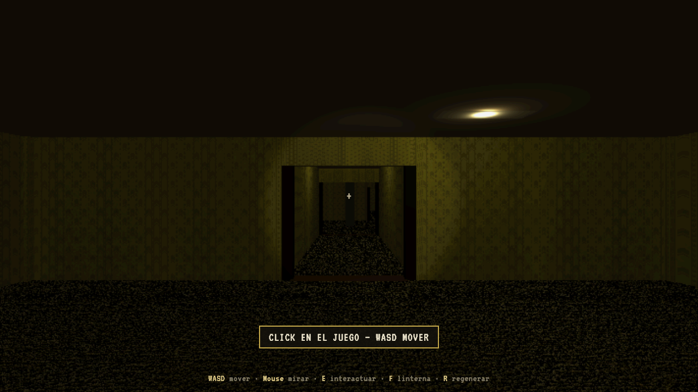

# BACKROOMS — Portfolio FPS

Explorador en primera persona estilo *Backrooms* / PS1 para recorrer el portfolio creativo de **VAMPS Studio**. Generación procedural de pasillos, salas temáticas por proyecto y micro-interacciones (linterna, tele, objetos).



## Qué es

- **FPS** en navegador (Three.js + Vite + TypeScript)
- Mapa con **spawn** en backrooms genéricos y **galería fija** con salas de proyecto (Tulipana, Copydad, VAMPS Brand, Pharma, Back2School…)
- Expansión **procedural** reutilizando las mismas piezas temáticas
- Estética **PS1**: resolución interna baja, post-proceso, texturas nearest-neighbor
- Portfolio integrado: acércate a una sala y pulsa **E** para abrir el panel del case

## Controles

| Tecla / acción | Función |
|----------------|---------|
| **Click** | Capturar ratón / audio ambiente |
| **WASD** | Mover |
| **Mouse** | Mirar |
| **E** | Interactuar (portfolio, tele, cajetilla…) |
| **F** | Linterna on/off |
| **R** | Regenerar mapa (nueva seed) |
| **Click** (con cajetilla) | Fumar / humo |

## Requisitos

- Node.js 20+
- npm

## Instalación y ejecución

```bash
npm install
npm run dev
```

Abre **http://localhost:5173/**

Build de producción:

```bash
npm run build
npm run preview
```

## Compartir en red (sin admin)

```bash
npm run dev          # expone en LAN con --host
npx cloudflared tunnel --url http://localhost:5173
```

> Vite está configurado con `allowedHosts: true` para túneles tipo Cloudflare.

## Estructura relevante

```
src/
  game/           Loop, jugador, linterna, iluminación, humo
  generation/     Dungeon + anillo galería (GalleryLoopTemplate)
  world/          RoomBuilder, layouts, modelos, TVs, láseres Copydad
  data/           Proyectos y variantes del portfolio
  rendering/      Pipeline PS1 + shader pantallas TV
public/
  room-layouts/   JSON de props por sala (editables con el Layout Editor)
  assets/         Modelos 3D, texturas, catálogo
```

## Salas e interacciones

- **Copydad**: malla de láseres de seguridad (rojos → verdes al entrar)
- **VAMPS Brand**: cajetilla recogible; **E** coger, **click** fumar
- **Teles**: **E** encender/apagar; imagen con efecto glitch
- **Salas temáticas**: iluminación de galería; el resto del mapa mantiene fluorescentes inestables

## Editor de layouts

Los muebles y props de cada sala viven en `public/room-layouts/*.json`.  
Para editarlos visualmente usa el **[Layout Editor](../backrooms-layout-editor)** (repo hermano) o, en este mismo proyecto:

```bash
npm run dev
# → http://localhost:5173/layout-editor.html
```

## Regenerar catálogo de assets

```bash
npm run catalog
```

Genera `public/assets/asset-catalog.json` (usado por el editor).

## Licencia

Proyecto privado / portfolio VAMPS Studio. Assets de terceros (itch.io, etc.) sujetos a sus licencias originales.
